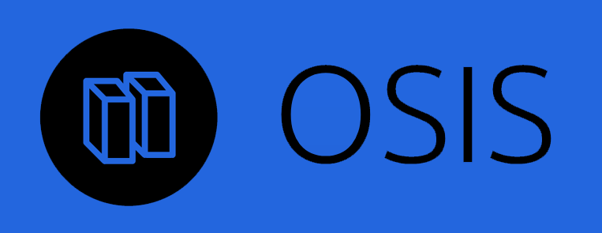

**API here : [http://dvergar.github.io/osis/ (latest, ](http://dvergar.github.io/osis/) [0.5.0)](http://dvergar.github.io/osis/0.5.0/)**  
Available on [haxelib](https://lib.haxe.org/p/osis/).

**Entity Component System architecture with networking support** (for haxe).

 * Simple API
 * Simple source
 * **Networking is optional**, none of the network API is polluating the ECS
 * API support for shared code betwen client & server
 * Automatic & fine-grained serialization of components via [PODStream](https://github.com/Dvergar/PODStream)
 * Avoids magic !

*(Iteration from old [ECS-Networking-Haxe](https://github.com/Dvergar/ECS-Networking-Haxe))*
 
Check out [the sample](https://github.com/Dvergar/OSIS/tree/master/sample-openfl) for a quick overview of the architecture. The library assumes you are in a client/server architecture where the server is authoritative.

### ECS ?

**Entity** is an aggregation of data-only **components**  
Logics are in **systems**  
**Systems** act on **components**

### Networking
* Components updates are always done from server to clients (not the opposite) and only at your demand.
* Messages are the only types of network events that can go both ways.
* In a game w/ this framework, communications should sum up to the client sending a list of pressed keys and/or events and the server dispatching everything else.

**Notes**

* Based on my network library [Anette](https://github.com/Dvergar/Anette) which is actually broken on the server websocket/JS target at the moment, OSIS is inheriting the same issue
* 64 components max, 64 entity sets max
* It's TCP, I really want UDP support so stay tuned for that

### Usage

#### Setup

```haxe
var em:EntityManager = new EntityManager();
```

If you're going networked you can get the network entity manager via.

```haxe
var net = em.listen("127.0.0.1", 32000);
```

on the server and

```haxe
var net = em.connect("127.0.0.1", 32000);
```
on the client.

#### EntitySet

An entity set will allow to manipulate entities having the specified components; here `CPosition` and `CMonster`.
```haxe
var entitySet = em.getEntitySet([CPosition, CMonster]);
```

You will then be able to iterate through `entitySet.adds`, `entitySet.changes`, `entitySet.removes` and `entitySet.entities`. `entitySet.applyChanges()` will update the entity set to the last changes.

#### System

A system is a really simple structure that will give you a `loop` where you can iterate over your entity sets and an `init` where you will initialize your entity sets.

Example :

```haxe
class MovementSystem extends System
{
    var entitySet:EntitySet;

    public override function init()
        entitySet = em.getEntitySet([CPosition, CMonster]);

    public override function loop()
    {
        entitySet.applyChanges();

        for(entity in entitySet.entities)
        {
            var pos = entity.get(CPosition);
            pos.x += 0.1;
            net.markChanged(entity, pos, entitySet);
        }
    }
}
```

`net.markChanged` here will notify the change to all the clients.

#### Network event

The content of an event is called a `Message` and will be shared among client & server, here is an example :

```haxe
class MessageHello implements Message
{
    @String public var txt:String;

    public function new() {}
}
```

The receiver registers to the event
```haxe
net.addEvent(MessageHello, function(msg:MessageHello, connection:Connection) {
    trace(msg.txt);
});
```

And the sender sends the message
```haxe
var msg = new MessageHello();
msg.txt = "coucou";
net.sendEvent(msg);
```

#### Templates

A template is a set of components defining a specific entity

```haxe
public function player()
{
  var entity = em.createEntity();
  var pos = em.addComponent(entity, new CPosition());

  return entity;
}
```

Adds a template like this
`em.addTemplate("player", player);`
and call the template like that `em.createEntity("player");`


#### Plugging everything together
```haxe
class Server
{
    var em:EntityManager = new EntityManager();
    var net:NetEntityManager;

    public function new()
    {
        net = em.listen("127.0.0.1", 32000);
        net.onConnection = onConnection;
        net.onDisconnection = onDisconnection;
        net.addEvent(MessageHello, onMessage);

        em.addSystem(new MovementSystem());

        while(true)
        {
            em.fixedUpdate(function()
            {
                em.processAllSystems();
            });
        }
    }

    function onMessage(msg:MessageHello, connection:Connection)
    {
        trace("Message: " + msg.txt);
    }
    
    function onConnection(connection:Connection)
    {
        var player = net.createEntity("player");
        net.bindEntity(connection, player);
        net.sendWorldStateTo(connection);

        var msg = new MessageHello();
        msg.txt = "youhou";
        net.sendEvent(msg);

        net.addComponent(player, new CHealer());
    }

    function onDisconnection(conn:Connection)
    {
        var boundEntity = net.getBoundEntity(conn);
        net.destroyEntity(boundEntity);
    }

    static function main() {new Server();}
}
```